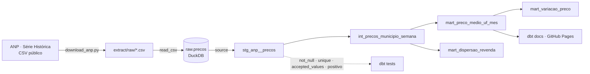

# dbt-dados-publicos

[](https://github.com/joaomatana/dbt-dados-publicos/actions/workflows/ci.yml)
[](https://www.getdbt.com/)
[](https://duckdb.org/)

ELT dos preços de combustíveis da ANP (dados públicos brasileiros) com **dbt + DuckDB**: do CSV cru a marts testados, com documentação e linhagem publicadas e refresh semanal automático.

## O que é
Pipeline de analytics engineering que baixa a Série Histórica de Preços de Combustíveis da ANP, trata o dado sujo real e o modela em camadas (staging → intermediate → marts) com testes, docs e CI/CD.

## Stack e os porquês
- **dbt-core** — transformação em SQL versionado, com testes, documentação e linhagem de graça; modelagem em camadas explícita.
- **DuckDB** — warehouse analítico **em arquivo**, zero infraestrutura: roda igual no laptop e no CI, lê CSV sujo nativamente e é rápido em agregação colunar. Sem custo de nuvem para um projeto de portfólio.
- **ELT, não ETL** — carrego o CSV cru primeiro (`raw` no DuckDB) e transformo **dentro** do warehouse com dbt. O bruto fica reprodutível e auditável; a regra de negócio vive em SQL testável, não num script de extração.
- **Python (requests)** — extração: descobre os arquivos na página da ANP, baixa e normaliza o encoding.
- **GitHub Actions** — build + testes + lint a cada push; refresh semanal que rebaixa, reconstrói e publica os docs no Pages.

## Arquitetura


## Tratamento de dado sujo (o diferencial)
A série da ANP é dado público real — e bagunçado. O pipeline trata, entre outros:
- **Encoding misto**: arquivos recentes em UTF-8 com BOM, antigos em Latin-1 → detecção e normalização para UTF-8.
- **Linhas em branco** entre registros (arquivos de GLP) → `strict_mode=false` na carga.
- **Quebra de linha embutida** em `Regiao - Sigla` (`\nCO`) → limpeza no staging.
- **Decimal com vírgula** (`6,29`), **datas BR** (`dd/mm/aaaa`) e CNPJ com espaço à esquerda.
- **Nomes de arquivo inconsistentes** na fonte (mudança de padrão por ano + um typo real) → URLs descobertas na página, não chutadas.
- **WAF do gov.br** que recusa requisições sem User-Agent de browser.

## Como rodar local
```bash
python -m venv .venv
source .venv/bin/activate             # Windows (PowerShell): .venv\Scripts\Activate.ps1
pip install -r requirements.txt

python extract/download_anp.py        # baixa a série recente e carrega no DuckDB
                                      # --full = série inteira | --ano-inicio AAAA | --produtos ...

cd dbt
dbt build                             # constrói models + roda os testes
dbt docs generate && dbt docs serve   # documentação navegável + DAG de linhagem
```

## Documentação e linhagem
Os docs do dbt (descrições, testes e o **DAG de linhagem**) são publicados no GitHub Pages a cada refresh semanal:
**https://joaomatana.github.io/dbt-dados-publicos/**

## Modelos
| Camada | Modelo | Descrição |
|--------|--------|-----------|
| staging | `stg_anp__precos` | limpeza/cast da fonte (grão: uma coleta por posto/produto) |
| intermediate | `int_precos_municipio_semana` | agregação por UF/município/produto/semana |
| mart | `mart_preco_medio_uf_mes` | preço médio ponderado por UF/produto/mês |
| mart | `mart_variacao_preco` | variação % mês a mês |
| mart | `mart_dispersao_revenda` | dispersão de preços entre municípios |

## Estrutura
```
extract/   download e carga dos CSVs da ANP no DuckDB
dbt/       projeto dbt: models/staging → intermediate → marts, testes e sources
.github/   CI (build/testes/lint) e refresh semanal com deploy dos docs
```
